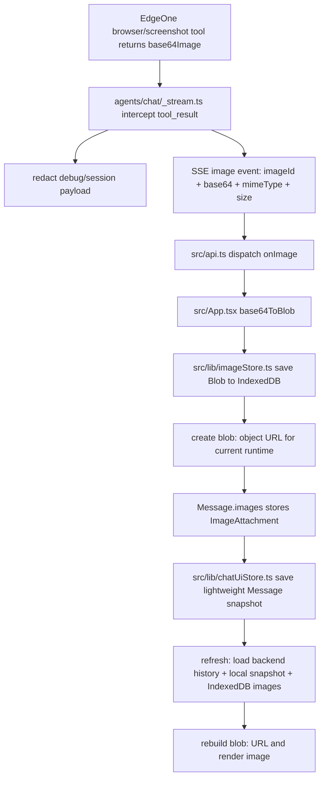

# 截图图片传输、存储与前后端 History 对齐实现总结

本文用于把 `claude-agent-starter` 中“工具截图图片”的处理方式同步到其他项目。目标是：

- 工具返回的 `base64Image` 只通过 SSE 传输一次；
- 前端收到后立即转成 `Blob` 并持久化到 IndexedDB；
- React 消息状态和本地 UI history 只保存图片引用，不保存 raw base64；
- 页面刷新后能从本地 IndexedDB 恢复图片显示；
- 后端 Claude session / debug / history 不被大段 base64 污染；
- 前后端通过同一套 `messageId` 对齐文本消息和图片引用。

---

## 1. 总体数据流



关键原则：

- `base64` 是临时传输格式，只在 SSE `image` 事件里出现一次。
- `Blob` 是浏览器侧真实持久化对象，存 IndexedDB。
- `blob:` URL 是运行时临时 URL，不能持久化，刷新后必须重新创建。
- `Message.images` 里持久化的是 `storageKey/imageId/mimeType/size/createdAt/persistent` 等引用信息。
- 刷新恢复时，**本地 snapshot 是唯一可信的 UI 来源**（包含图片引用）；后端 history 只用于 snapshot 不存在时的降级。
- 前后端 messageId 对齐是 best-effort 优化，不是恢复图片的必要保障。

---

## 2. 类型设计

参考文件：`src/types.ts`。

```ts
export interface ImageAttachment {
  id: string;              // 图片 ID，来自 SSE imageId
  storageKey: string;      // IndexedDB key: `${conversationId}/${imageId}`
  url: string;             // 运行时 blob: URL，只用于渲染，不持久化
  mimeType: string;
  size: number;
  createdAt: number;
  persistent: boolean;     // 是否已成功写入 IndexedDB
}

export interface ImageSsePayload {
  imageId: string;
  base64: string;
  mimeType?: string;
  size?: number;
}

export interface Message {
  id: string;
  role: 'user' | 'assistant';
  content: string;
  timestamp: number;
  images?: (ImageAttachment | string)[];
}
```

注意：

- `ImageAttachment.url` 只能存在于运行时 React state，不能进入 IndexedDB snapshot。
- `images?: string[]` 只作为旧数据兼容，新实现不要再把 base64 字符串塞进 `Message.images`。

---

## 3. 后端：从工具结果中提取截图并通过 SSE 传给前端

参考文件：`agents/chat/_stream.ts`。

### 3.1 提取 `base64Image`

在 Claude SDK 流里，工具结果通常出现在 `msg.type === 'user'` 的 tool result 中。后端需要检查 tool result 文本中是否包含 `base64Image`，解析后发送独立的 SSE `image` 事件。

SSE payload 示例：

```ts
enqueueSse(controller, encoder, 'image', {
  imageId: crypto.randomUUID(),
  base64,
  mimeType: 'image/png',
  size: base64.length,  // 注意：这是 base64 编码后的字符数，实际字节数约为 base64.length * 3/4
});
```

要求：

- `imageId` 由后端生成，前端用它生成 IndexedDB `storageKey`。
- `base64` 只在 `image` 事件中发送，不要写入普通文本消息。
- `mimeType` 默认可用 `image/png`。
- `size` 是 base64 字符长度（非解码后字节数）。前端实际用 `blob.size` 获取真实大小。

### 3.2 后端 debug 和 session 脱敏

后端应对所有 debug/session 写入做递归脱敏：

- 对象字段名为 `base64Image` 且值较长时，替换成占位符；
- 字符串中包含 JSON 形式的 `"base64Image":"..."` 时，用正则替换；
- `debug_msg`、`debug_block`、日志 preview、sessionStore 写入都要避免原始 base64。

占位示例：

```txt
[REDACTED image data]
[screenshot image saved to client]
```

---

## 4. 前端：SSE 接收和一次性 base64 处理

参考文件：`src/api.ts`、`src/App.tsx`。

### 4.1 `/chat` 请求携带前端生成的消息 ID

发送消息前，前端先生成两个 ID：

```ts
const userMsgId = crypto.randomUUID();
const botMsgId = crypto.randomUUID();
```

前端消息状态：

```ts
const userMsg = { id: userMsgId, role: 'user', content: text, timestamp: Date.now() };
const botMsg = { id: botMsgId, role: 'assistant', content: '', timestamp: Date.now() };
```

请求体需要携带：

```json
{
  "message": "...",
  "userMsgId": "...",
  "botMsgId": "..."
}
```

目的：后端 `appendMessage` 使用同样的 `messageId` 保存，刷新后 `/history` 返回的消息 ID 能和前端本地 snapshot 对齐。

### 4.2 接收 `image` SSE 事件

`api.ts` 解析 `event: image` 后调用：

```ts
cb.onImage({
  imageId: parsed.imageId || crypto.randomUUID(),
  base64: parsed.base64,
  mimeType: parsed.mimeType || 'image/png',
  size: parsed.size || 0,
});
```

注意：

- `onImage` 拿到完整 base64，前端用它写入 IndexedDB。
- SSE `image` 事件**必须**携带完整 base64（这是唯一传输通道，不能 redact）。
- 后端 `debug_msg` 事件的 preview 会做 redaction，但 `image` 事件本身不做。
- 如果前端 debug panel 通过 `onRawEvent` 展示所有 raw events，应在 UI 层对 `image` 类事件的 `base64` 字段做截断展示（如只显示 `base64.slice(0, 50) + '...'`），避免 DOM 中嵌入大段 base64。

---

## 5. 前端：IndexedDB 图片存储 `imageStore`

参考文件：`src/lib/imageStore.ts`。

### 5.1 IndexedDB 结构

数据库：`tool-images-db`  
对象仓库：`images`  
主键：`storageKey`  
索引：

- `byConversation`: `conversationId`
- `byMessage`: `[conversationId, messageId]`

记录结构：

```ts
interface StoredImageRecord {
  storageKey: string;       // `${conversationId}/${imageId}`
  conversationId: string;
  messageId: string;
  imageId: string;
  blob: Blob;
  mimeType: string;
  size: number;
  createdAt: number;
}
```

### 5.2 核心方法

需要实现这些方法：

- `base64ToBlob(base64, mimeType)`：把 SSE base64 转为 `Blob`；
- `makeStorageKey(conversationId, imageId)`：生成稳定 key；
- `saveImage({ conversationId, messageId, imageId, blob, mimeType })`：保存图片；
- `loadConversationImages(conversationId)`：刷新时加载当前会话所有图片；
- `deleteConversationImages(conversationId)`：清空会话时删除图片；
- `createObjectUrl(storageKey, blob)`：创建或复用运行时 `blob:` URL；
- `revokeAllObjectUrls()`：清理内存。

---

## 6. 前端：本地 UI history `chatUiStore`

参考文件：`src/lib/chatUiStore.ts`。

### 6.1 为什么需要 `chatUiStore`

后端 history 只保存文本消息，不保存浏览器 IndexedDB 中的 Blob URL 和图片引用。因此前端必须额外保存一份轻量 UI snapshot：

```ts
interface SnapshotRecord {
  conversationId: string;
  messages: Message[];
  updatedAt: number;
}
```

其中 `messages` 包含 `images` 引用，但不包含：

- raw base64；
- `blob:` URL。

### 6.2 保存 snapshot 前必须清洗

保存前对 `messages` 做 sanitize：

- 如果 `img` 是旧版 base64 string，直接丢弃，不持久化；
- 如果 `img` 是 `ImageAttachment`，移除 `url` 字段，只保留 `id/storageKey/mimeType/size/createdAt/persistent`。

示例逻辑：

```ts
const { url: _url, ...rest } = img;
return rest;
```

### 6.3 何时保存 snapshot

推荐在 `messages` 变化后 debounce 保存：

```ts
const initDoneRef = useRef(false);

useEffect(() => {
  if (messages.length === 0) return;
  if (!initDoneRef.current) return; // 恢复阶段不保存
  const timer = setTimeout(() => {
    saveSnapshot(conversationId, messages);
  }, 500);
  return () => clearTimeout(timer);
}, [messages]);
```

关键保护：`initDoneRef` 在**用户首次发送消息时**才设为 `true`，而不是在恢复加载完成后。这样即使恢复过程中 `setMessages` 触发了 effect，也不会把”未成功合并图片的 messages”覆盖进 snapshot。只有用户真正交互后才开始持久化新状态。

```ts
const handleSend = () => {
  initDoneRef.current = true; // 解锁 snapshot 保存
  // ...
};
```

---

## 7. 前后端 messageId 对齐（Best-effort，非核心保障）

前端生成 `userMsgId` 和 `botMsgId` 并传给后端保存，目的是让 `/history` 返回的消息 ID 和本地 snapshot 一致。但这一机制**依赖 store SDK 支持自定义 messageId**。

> ⚠️ 如果 store SDK 忽略了 `messageId` 字段（使用自动生成的 ID），前后端 ID 不会对齐。
> 此时恢复策略应退回到"snapshot 为唯一 UI 来源、history 纯降级"（见 Section 8）。
> **不要依赖 ID 对齐作为图片恢复的唯一保障。**

### 7.1 前端生成 ID

每轮对话前端生成：

- `userMsgId`
- `botMsgId`

并同时用于：

- React state 中的 `Message.id`；
- `/chat` 请求体；
- 图片保存时的 `messageId`；
- 本地 snapshot 的 `Message.id`。

### 7.2 后端保存相同 ID

参考文件：`agents/chat/index.ts`。

保存用户消息：

```ts
await store.appendMessage({
  conversationId,
  role: 'user',
  content: message,
  messageId: userMsgId,
});
```

参考文件：`agents/chat/_stream.ts`。

保存助手消息：

```ts
await store.appendMessage({
  conversationId,
  role: 'assistant',
  content: state.fullAssistantText,
  messageId: botMsgId,
});
```

建议：如果本轮只有图片、没有文本，也要保存一条 assistant 占位消息，保证 `botMsgId` 出现在后端 history 中。例如：

```ts
const content = state.fullAssistantText.trim() || '[image]';
await store.appendMessage({ conversationId, role: 'assistant', content, messageId: botMsgId });
```

否则后端 history 中可能没有对应 assistant 消息，刷新时无法通过 ID 把图片挂回去。

### 7.3 `/history` 返回相同 ID

参考文件：`agents/history/index.ts`。

```ts
messages.push({
  id: item.messageId ?? `${role}-${item.createdAt ?? 0}`,
  role,
  content,
  timestamp: item.createdAt ?? 0,
});
```

要求：

- 优先使用 `item.messageId`；
- 不要重新生成随机 ID；
- 不要跳过有图片但文本为空的 assistant 消息，至少返回占位内容。

---

## 8. 刷新恢复与合并策略

刷新时并行加载三份数据：

```ts
const [history, snapshot, storedImages] = await Promise.all([
  fetchConversationHistory(conversationId),
  loadSnapshot(conversationId),
  loadConversationImages(conversationId),
]);
```

### 8.1 重建图片 URL

先从 IndexedDB Blob 重建运行时 URL：

```ts
const imageUrlMap = new Map<string, { url: string; mimeType: string; size: number; storageKey: string }>();
for (const record of storedImages) {
  const url = createObjectUrl(record.storageKey, record.blob);
  imageUrlMap.set(record.imageId, {
    url,
    mimeType: record.mimeType,
    size: record.size,
    storageKey: record.storageKey,
  });
}
```

然后把 snapshot 里的图片引用补回 `url`：

```ts
const urlInfo = imageUrlMap.get(img.id);
const restored = urlInfo ? { ...img, url: urlInfo.url, persistent: true } : img;
```

### 8.2 合并策略：snapshot 优先，history 纯降级

**核心原则：不做双向合并。** Snapshot 包含完整 UI 状态（文本 + 图片引用），是唯一可信的 UI 来源。后端 history 只在 snapshot 不存在时作为安全网。

实际代码：

```ts
let merged: Message[];

if (snapshot.length > 0) {
  // Snapshot 是权威 UI 来源（包含图片引用）
  // 只需要从 IndexedDB 重建 blob: URL
  merged = snapshot.map(msg => ({
    ...msg,
    images: rebuildImages(msg.images),
  }));
} else if (history.length > 0) {
  // 没有本地 snapshot（IndexedDB 被清除、换浏览器等）
  // 降级到后端 history，此时图片无法恢复，只显示文本
  merged = history;
} else {
  merged = [];
}
```

**为什么不做双向合并（snapshot + history 按 ID 互补）：**

1. EdgeOne store SDK 可能不支持自定义 `messageId`，后端 history 的 ID 和前端 UUID 对不上；
2. 按 ID 合并时，未匹配的 history 消息会被追加，导致同一条消息出现两次（一个带图一个不带）；
3. Snapshot 已经是 `messages` state 的完整镜像，不需要 history 补充。

**何时可以考虑双向合并：**

- 确认 store SDK 支持自定义 `messageId` 并且 `/history` 稳定返回该 ID；
- 有多设备/多标签页同步需求，需要从 history 获取其他端新增的消息。

如果确实需要双向合并，参考以下策略（注意必须先验证 ID 对齐）：

```ts
// ⚠️ 只在确认 store 支持自定义 messageId 时使用
const historyMap = new Map(history.map(msg => [msg.id, msg]));

merged = snapshot.map(msg => {
  const historyMsg = historyMap.get(msg.id);
  const rebuiltImages = rebuildImages(msg.images);
  if (historyMsg) {
    historyMap.delete(msg.id);
    return { ...msg, content: historyMsg.content || msg.content, images: rebuiltImages };
  }
  return { ...msg, images: rebuiltImages };
});

// 追加 snapshot 中没有但 history 有的消息（其他端新增）
for (const msg of historyMap.values()) {
  merged.push(msg);
}
```

---

## 9. 渲染图片

参考文件：`src/components/ChatBubble.tsx`。

渲染时：

- 新数据：使用 `ImageAttachment.url`；
- 旧数据：如果还是 base64 string，可临时渲染成 `data:image/png;base64,...`。

```ts
function getImageSrc(img: ImageAttachment | string): string {
  if (typeof img === 'string') return `data:image/png;base64,${img}`;
  return img.url || '';
}
```

如果 `url` 为空，不渲染该图片。

---

## 10. 清空会话时的清理

清空聊天时必须同步清理三类状态：

```ts
revokeAllObjectUrls();
await deleteConversationImages(oldConversationId);
await deleteSnapshot(oldConversationId);
localStorage.removeItem(CONVERSATION_ID_STORAGE_KEY);
```

然后创建新的 `conversationId`。

---

## 11. 常见问题和修复建议

### 11.1 为什么刷新后图片不显示？

优先检查：

1. IndexedDB `tool-images-db/images` 中是否有当前 `conversationId` 的 Blob 记录；
2. IndexedDB `chat-ui-store-db/snapshots` 中是否有当前 `conversationId` 的 snapshot；
3. snapshot 的 assistant 消息中是否有 `images` 引用；
4. `/history` 返回的 assistant 消息 `id` 是否等于前端 `botMsgId`；
5. 合并逻辑是否保留了 snapshot-only 的图片消息；
6. 恢复后是否重新 `createObjectUrl`，而不是使用旧的 `blob:` URL。

### 11.2 只做”后端保存前端 messageId”为什么还不够？

两个层面的问题：

**层面一：store SDK 可能不支持。** 有些 store SDK（如 EdgeOne Pages 的内置 store）会忽略自定义 `messageId` 字段，使用自动生成的 ID。此时后端 history 的消息 ID 永远和前端 UUID 对不上。

**层面二：即使 ID 对齐了，后端可能不保存图片消息。** 如果本轮助手没有文本，后端可能不会保存 assistant 消息；或者 `/history` 会跳过空内容消息。此时前端 snapshot 中有图片消息，但后端 history 没有对应消息。如果恢复逻辑只遍历后端 history，就会把图片消息丢掉。

**因此，正确的恢复策略不应依赖 ID 对齐：**

- 使用 snapshot 作为唯一 UI 来源（它包含完整消息列表和图片引用）；
- 后端 history 只在 snapshot 不存在时降级使用；
- 后端保存 assistant 占位消息（`[image]`）只是 best-effort 优化，不是必要条件。

### 11.3 为什么不能保存 `blob:` URL？

`blob:` URL 只在当前页面运行时有效，刷新后失效。持久化应保存：

- IndexedDB 中的 `Blob`；
- snapshot 中的 `storageKey/imageId`。

刷新后重新创建新的 `blob:` URL。

### 11.4 为什么不能把 `indexeddb://...` 给后端或 Claude？

浏览器 IndexedDB 只在前端本机可访问，后端和 Claude 无法读取。因此模型上下文中只能保存文字摘要或占位符，不能依赖前端本地 URL。

---

## 12. 迁移到其他项目的最小改造清单

按以下顺序迁移：

1. 新增 `ImageAttachment`、`ImageSsePayload` 类型；
2. 后端流式接口识别工具结果里的 `base64Image`；
3. 后端新增 SSE `image` 事件（含 imageId/base64/mimeType/size）；
4. 后端 debug/session/history 对 `base64Image` 脱敏；
5. 前端 `api` 层支持 `onImage(ImageSsePayload)` 回调；
6. 新增 `imageStore`，用 IndexedDB 保存 Blob；
7. 新增 `chatUiStore`，保存去掉 `url` 的轻量 `Message[]`；
8. 前端收到 image 事件后：`base64ToBlob` → `saveImage` → `createObjectUrl` → 追加 `ImageAttachment` 到消息；
9. 前端发送消息时生成并上传 `userMsgId/botMsgId`（best-effort，见 Section 7）；
10. 后端 `appendMessage` 尝试使用前端传入的 `messageId`；
11. 后端即使 assistant 文本为空也保存占位消息（`[image]`）；
12. 刷新时并行加载 `history + snapshot + storedImages`；
13. **恢复策略：snapshot 优先、history 降级**（不做双向合并）；
14. 用 IndexedDB Blob 重新 `createObjectUrl` 为图片引用补回 `url`；
15. 初始化恢复阶段禁止覆写 snapshot（`initDoneRef` 守卫）；
16. 清空会话时删除 IndexedDB 图片、snapshot 和 revoke 所有 object URL；
17. 渲染兼容 `ImageAttachment`（blob: URL）和旧 `string`（data URI）；
18. （可选）debug panel 对 `image` 类 raw event 做 base64 截断展示。

---

## 13. 验证清单

完成后用以下场景验证：

- 工具截图后，页面立即显示图片；
- React message state 中没有 raw base64；
- Debug panel 中没有完整 base64；
- 后端 history response 中没有完整 base64；
- 刷新页面后图片仍可显示；
- DevTools IndexedDB 中可以看到 Blob 图片记录；
- `chatUiStore` snapshot 里只有图片引用，没有 `blob:` URL 和 base64；
- 清空历史后 IndexedDB 中当前会话图片和 snapshot 被删除；
- 多轮对话中每张图片都挂在正确的 assistant 消息下；
- 只有图片、没有文本的 assistant 回复刷新后也能恢复。
